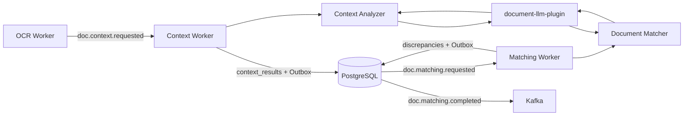

# Архитектура LLM-компонента сервиса контроля документации

**Статус:** предложение для согласования  
**Область:** Context Worker и Matching Worker  
**Версия документа:** 1.0

## 1. Краткое решение

LLM-функциональность предлагается реализовать как независимо версионируемый Python-пакет `document-llm-plugin`, подключаемый к бизнес-воркерам Context и Matching как обычная зависимость.

Плагин не становится отдельным оркестратором, не управляет Kafka, транзакциями, статусами задач или публикацией интеграционных событий. Эти обязанности сохраняются за существующими компонентами системы. Плагин отвечает только за предметную обработку документов:

- извлечение структурированного контекста из результатов OCR;
- поиск и проверку расхождений между документами;
- формирование строго типизированного результата со ссылками на источники;
- абстракцию от конкретного поставщика и способа запуска модели.

Такое решение сохраняет основную архитектуру системы, позволяет независимо развивать LLM-часть и исключает зависимость бизнес-воркеров от конкретной модели или API.

## 2. Цели и границы

### 2.1. Цели

- Встроить LLM-обработку без изменения Gateway, Saga, Outbox и существующего жизненного цикла задач.
- Сохранить текущие Kafka-топики и ответственность компонентов.
- Обеспечить заменяемость модели без изменения бизнес-воркеров.
- Исключить передачу невалидного или неподтверждённого результата в основную систему.
- Обеспечить трассируемость каждого вывода до страниц и блоков исходного документа.
- Версионировать модель, промпты и схемы результата независимо от системного ядра.
- Поддержать локальный и удалённый режим инференса.

### 2.2. Не входит в область ответственности

LLM-плагин не должен:

- принимать HTTP-запросы пользователей;
- создавать или менять задачи;
- самостоятельно подписываться на Kafka-топики;
- публиковать интеграционные события;
- управлять транзакциями PostgreSQL;
- менять статусы шагов обработки;
- реализовывать идемпотентность доставки сообщений;
- выполнять функции Saga или принимать решения о компенсации;
- формировать неподтверждённые факты без ссылки на исходный документ.

## 3. Место в общей архитектуре



Интеграция выполняется внутри бизнес-логики соответствующего воркера:

1. `Context Worker` получает `doc.context.requested`.
2. Воркёр загружает результаты OCR и вызывает `ContextAnalyzer` из плагина.
3. После успешной проверки результата воркёр сохраняет `context_results`, завершает шаг Context и создаёт `doc.matching.requested` через Outbox.
4. `Matching Worker` получает `doc.matching.requested`.
5. Воркёр загружает документы и контекст, затем вызывает `DocumentMatcher`.
6. Проверенные расхождения сохраняются в PostgreSQL, а `doc.matching.completed` создаётся через Outbox.

Плагин возвращает данные вызывающему воркеру, но не выполняет инфраструктурные операции самостоятельно.

## 4. Компоненты LLM-плагина

### 4.1. Предлагаемая структура пакета

```text
document-llm-plugin/
├── document_llm/
│   ├── domain/
│   │   ├── context_models.py
│   │   ├── matching_models.py
│   │   └── evidence.py
│   ├── ports/
│   │   ├── generator.py
│   │   ├── embeddings.py
│   │   └── document_loader.py
│   ├── pipelines/
│   │   ├── context_pipeline.py
│   │   └── matching_pipeline.py
│   ├── adapters/
│   │   ├── openai_compatible.py
│   │   ├── ollama.py
│   │   ├── vllm.py
│   │   └── minio_loader.py
│   ├── prompting/
│   │   ├── context_v1.py
│   │   └── matching_v1.py
│   ├── validation/
│   │   ├── grounding.py
│   │   ├── repair.py
│   │   └── confidence.py
│   ├── observability/
│   │   └── metrics.py
│   └── factory.py
├── tests/
├── pyproject.toml
└── CHANGELOG.md
```

### 4.2. Публичные интерфейсы

Публичный API пакета должен оставаться минимальным и не зависеть от Kafka, SQLAlchemy или конкретного LLM-провайдера.

```python
from typing import Protocol


class ContextAnalyzer(Protocol):
    def analyze(self, request: ContextRequest) -> ContextResult:
        ...


class DocumentMatcher(Protocol):
    def match(self, request: MatchingRequest) -> MatchingResult:
        ...
```

Создание реализации выполняется через фабрику конфигурации:

```python
analyzer = create_context_analyzer(settings)
matcher = create_document_matcher(settings)
```

Воркёр не должен напрямую создавать HTTP-клиент, выбирать модель или собирать промпт.

## 5. Контракт Context Analyzer

### 5.1. Входные данные

`ContextRequest` должен содержать:

- `task_id`;
- `tenant_id`;
- `file_id`;
- `ocr_result_id`;
- `processing_version`;
- язык документа;
- тип задачи;
- OCR-блоки с идентификатором страницы и блока;
- разрешённые параметры обработки.

Пример логической модели OCR-блока:

```json
{
  "page": 12,
  "block_id": "p12-b07",
  "text": "Арматура класса А500С, диаметр 12 мм",
  "bbox": [115, 420, 760, 468],
  "ocr_confidence": 0.96
}
```

### 5.2. Этапы обработки

1. Нормализация OCR-текста без изменения исходных идентификаторов.
2. Выделение логических разделов, страниц, таблиц и подписей.
3. Разбиение на ограниченные по размеру фрагменты с небольшим перекрытием.
4. Локальное извлечение сущностей из каждого фрагмента.
5. Проверка ответа по строгой JSON-схеме.
6. Проверка ссылок на существующие страницы и OCR-блоки.
7. Детерминированное объединение и устранение дублей.
8. Расчёт итоговой уверенности и фиксация предупреждений.

### 5.3. Выходные данные

`ContextResult` должен содержать:

- структурированные сущности;
- иерархию разделов;
- номера чертежей и документов;
- позиции спецификаций;
- размеры, значения и единицы измерения;
- ссылки на нормативные требования;
- связи между сущностями;
- ссылки на страницы и OCR-блоки для каждого результата;
- метаданные модели и промпта;
- предупреждения и сведения о частично обработанных фрагментах.

Пример сущности:

```json
{
  "entity_id": "ent-001",
  "type": "dimension",
  "value": "12",
  "unit": "mm",
  "normalized_value": 12.0,
  "confidence": 0.94,
  "evidence": [
    {
      "file_id": "file-456",
      "page": 12,
      "block_id": "p12-b07"
    }
  ]
}
```

## 6. Контракт Document Matcher

### 6.1. Входные данные

`MatchingRequest` должен содержать:

- `task_id`;
- `tenant_id`;
- `processing_version`;
- идентификаторы сравниваемых документов;
- структурированный Context по каждому документу;
- доступные OCR-блоки;
- пороги сравнения;
- перечень сравниваемых полей;
- применимый профиль правил.

### 6.2. Двухступенчатое сопоставление

Полные документы не должны отправляться в один LLM-запрос. Сопоставление выполняется в два этапа.

#### Этап 1. Поиск кандидатов

Детерминированные алгоритмы и embeddings формируют ограниченный набор потенциальных пар по следующим признакам:

- номер и код документа;
- номер чертежа;
- раздел и позиция спецификации;
- наименование элемента;
- единица измерения;
- близость числовых значений;
- текстовое или векторное сходство.

#### Этап 2. Проверка кандидатов

LLM получает только выбранную пару фрагментов и должна:

- подтвердить соответствие объектов;
- определить наличие расхождения;
- описать расхождение нейтральным техническим языком;
- вернуть доказательства с обеих сторон;
- оценить уверенность;
- предложить категорию критичности.

Категория критичности принимается только после проверки системными правилами. LLM не является единственным источником решения о критичности.

### 6.3. Результат сопоставления

```json
{
  "discrepancy_id": "disc-001",
  "severity": "major",
  "category": "dimension_mismatch",
  "description": "Диаметр арматуры различается: 12 мм в ПД и 10 мм в РД",
  "left_value": "12 mm",
  "right_value": "10 mm",
  "left_evidence": [
    {"file_id": "doc-pd-111", "page": 12, "block_id": "p12-b07"}
  ],
  "right_evidence": [
    {"file_id": "doc-rd-222", "page": 8, "block_id": "p08-b11"}
  ],
  "confidence": 0.93,
  "rule_id": "DIMENSION_EXACT_MISMATCH"
}
```

Итоговый протокол формируется детерминированным renderer-компонентом из проверенного списка расхождений. Свободная генерация итогового протокола моделью не допускается.

## 7. Независимость от поставщика модели

Внутренний порт генерации структурированных данных:

```python
class StructuredGenerator(Protocol):
    def generate(
        self,
        *,
        system_prompt: str,
        user_prompt: str,
        response_schema: dict[str, object],
        request_id: str,
    ) -> str:
        ...
```

Через адаптеры могут поддерживаться:

- OpenAI-compatible API;
- локальный Ollama;
- vLLM;
- корпоративный модельный шлюз;
- тестовая детерминированная реализация без LLM.

Выбор провайдера выполняется конфигурацией окружения. Смена провайдера не должна изменять интерфейсы Context и Matching.

Для MVP рекомендуется OpenAI-compatible интерфейс. Он позволяет одинаково подключать удалённую модель, локальный vLLM и Ollama.

## 8. Валидация и защита от недостоверного результата

LLM-ответ считается промежуточным недоверенным вводом. До передачи результата воркеру обязательны следующие проверки:

1. Валидация по строгой Pydantic/JSON-схеме с запретом неизвестных полей.
2. Проверка допустимых enum-значений.
3. Проверка диапазона `confidence`.
4. Проверка существования всех `page`, `block_id` и `file_id`.
5. Проверка принадлежности источника текущему `tenant_id` и заданию.
6. Проверка числовых значений и единиц измерения.
7. Запрет результата без доказательной ссылки для фактов и расхождений.
8. Удаление или отклонение ссылок на неизвестные сущности.
9. Контролируемая попытка исправления структурно невалидного ответа.
10. Отказ от ответа при недостаточности доказательств.

Допустимые состояния отдельного результата:

- `accepted` — результат прошёл все проверки;
- `low_confidence` — результат сохранён как требующий проверки;
- `abstained` — модель отказалась от вывода из-за недостаточности данных;
- `rejected` — результат нарушил контракт или не подтверждён источником.

`abstained` не считается инфраструктурной ошибкой и не должно автоматически приводить к DLQ. Инфраструктурной ошибкой считаются недоступность модели, timeout, нарушение протокола или невозможность получить валидный ответ после разрешённых попыток.

## 9. Транзакции, идемпотентность и повторы

### 9.1. Разделение ответственности

`worker-core` отвечает за:

- получение Kafka-сообщения;
- проверку `consumed_events`;
- PostgreSQL-транзакцию;
- сохранение Outbox-события;
- commit Kafka offset после успешной транзакции;
- worker-level retry и публикацию в DLQ.

LLM-плагин отвечает за:

- таймаут модельного вызова;
- проверку структуры ответа;
- ограниченное исправление невалидного JSON;
- детерминированность ключей и метаданных результата.

### 9.2. Детерминированный идентификатор запроса

Для логического LLM-вызова формируется ключ:

```text
SHA-256(
  tenant_id
  + task_id
  + processing_version
  + operation
  + input_hash
  + model_version
  + prompt_version
  + schema_version
)
```

Ключ используется для трассировки и безопасного повторного использования результата. Он не заменяет идемпотентность Kafka consumer.

### 9.3. Политика повторов

Не допускается неконтролируемое умножение повторов между клиентом модели и Worker Core.

Рекомендуемая политика:

- не более одной повторной попытки при временной транспортной ошибке;
- не более двух попыток исправления структурно невалидного ответа;
- worker-level retry остаётся основным механизмом повторной обработки события;
- ошибки аутентификации, несовместимая схема и превышение контекстного окна не повторяются без изменения входа или конфигурации;
- каждый повтор использует тот же детерминированный request key.

## 10. Управление версиями

Пакет выпускается независимо по Semantic Versioning:

```text
document-llm-plugin==1.0.0
```

Отдельно фиксируются:

- версия Python-пакета;
- поставщик и имя модели;
- версия или digest модели;
- версия system prompt;
- версия JSON-схемы;
- версия правил сопоставления;
- параметры генерации.

Каждый сохранённый результат должен содержать:

```json
{
  "plugin_version": "1.0.0",
  "provider": "openai-compatible",
  "model": "model-name",
  "model_version": "model-digest-or-release",
  "prompt_version": "context-v1",
  "schema_version": "context-result-v1",
  "input_hash": "sha256:..."
}
```

Обновление плагина происходит через изменение pinned-версии в образе соответствующего воркера. Публикация новой версии пакета сама по себе не изменяет работающие сервисы.

## 11. Развёртывание

### 11.1. Рекомендуемый режим для MVP

- Плагин устанавливается в Docker-образы Context Worker и Matching Worker.
- Модель доступна через OpenAI-compatible HTTP endpoint.
- Конфигурация передаётся через переменные окружения и Kubernetes Secret.
- Локальный дисковый кэш по умолчанию отключён.
- Context и Matching масштабируются независимо по Kafka lag.

### 11.2. Варианты размещения модели

| Режим | Применение | Особенности |
|---|---|---|
| Внешний API | быстрый MVP | минимальная инфраструктура, требуется контроль передачи данных |
| Корпоративный LLM Gateway | production | централизованные политики, аудит и лимиты |
| vLLM в отдельном Deployment | локальный GPU-инференс | независимое GPU-масштабирование |
| Ollama | локальная разработка и демонстрация | простой запуск, не основной production-вариант |

Размещение модели не влияет на контракты плагина и воркеров.

## 12. Конфигурация

Минимальный набор параметров:

```text
LLM_PROVIDER=openai-compatible
LLM_ENDPOINT=https://llm-gateway.example/v1/chat/completions
LLM_API_KEY=<secret>
LLM_CONTEXT_MODEL=<model>
LLM_MATCHING_MODEL=<model>
LLM_TIMEOUT_SECONDS=90
LLM_TRANSPORT_RETRIES=1
LLM_VALIDATION_RETRIES=2
LLM_TEMPERATURE=0
LLM_MAX_OUTPUT_TOKENS=4000
LLM_PROMPT_VERSION=context-v1
LLM_MATCHING_PROMPT_VERSION=matching-v1
LLM_STORE_RAW_RESPONSES=false
```

Секреты не должны попадать в события Kafka, логи, таблицы результатов или Docker-образы.

## 13. Безопасность и изоляция данных

- `tenant_id` передаётся во все внутренние запросы и проверяется при загрузке данных.
- Плагин получает только документы текущей задачи.
- Доступ к MinIO выполняется через инфраструктурный адаптер с ограниченными правами.
- Исходный текст не записывается в логи.
- Полные prompt/response не сохраняются по умолчанию.
- При необходимости аудита сохраняются хэши входа, версии и обезличенные диагностические данные.
- При использовании внешнего API должна быть отдельно согласована возможность передачи документов и персональных данных.
- Для локального размещения модели трафик ограничивается внутренним сетевым контуром.
- Все сетевые соединения к модельному endpoint используют TLS.

## 14. Наблюдаемость

Плагин публикует метрики через интерфейс наблюдаемости вызывающего воркера:

- `llm_requests_total{operation,model,status}`;
- `llm_request_duration_seconds{operation,model}`;
- `llm_input_tokens_total{operation,model}`;
- `llm_output_tokens_total{operation,model}`;
- `llm_validation_failures_total{operation,reason}`;
- `llm_abstentions_total{operation,reason}`;
- `llm_grounding_rejections_total{operation}`;
- `llm_estimated_cost_total{operation,model}` — при наличии тарификации.

В tracing span фиксируются:

- `task_id` и `correlation_id`;
- операция;
- модель и версия промпта;
- request key;
- размер входа;
- длительность;
- число repair-попыток;
- итоговый статус.

Текст документов, prompt и полный ответ модели в span не записываются.

## 15. Производительность и ограничения ресурсов

- Размер фрагментов рассчитывается по токенам, а не только по символам.
- Максимальный размер контекста задаётся отдельно для Context и Matching.
- Matching использует предварительный поиск кандидатов, чтобы не сравнивать каждую пару фрагментов через LLM.
- Входные запросы ограничиваются по количеству страниц, блоков и кандидатов.
- Для каждой операции задаются timeout и максимальное число генерируемых токенов.
- Параллелизм внутри pod ограничивается с учётом доступной памяти и лимитов модельного endpoint.
- Backpressure обеспечивается существующей Kafka-очередью и масштабированием воркеров.

## 16. Отказоустойчивость и деградация

| Ситуация | Поведение |
|---|---|
| Временная недоступность endpoint | ограниченный retry, затем worker-level retry |
| Timeout | вызов прерывается, ошибка передаётся Worker Core |
| Невалидный JSON | repair-попытка, затем ошибка контракта |
| Неподтверждённая ссылка | элемент отклоняется или весь ответ признаётся невалидным |
| Недостаточно данных | `abstained`, без инфраструктурного DLQ |
| Частично обработан документ | результат содержит предупреждение и перечень необработанных фрагментов |
| Matching исчерпал повторы | задача переводится в состояние частичного результата существующим механизмом Matching Worker |

Fallback на другую модель допускается только как явно настроенная политика. В результате всегда фиксируется фактически использованная модель. Бесшумная замена модели запрещена.

## 17. Известное архитектурное ограничение

Вызов бизнес-логики воркера выполняется внутри открытой PostgreSQL-транзакции. Длительный LLM-запрос в таком режиме удерживает соединение и может увеличить время жизни транзакции.

Для MVP предлагаются следующие ограничения:

- жёсткий timeout модельного вызова;
- ограниченная конкуренция одного экземпляра воркера;
- отдельный пул соединений для LLM-воркеров;
- отсутствие сетевых повторов с длительной экспоненциальной задержкой внутри одного вызова;
- мониторинг длительности транзакций и занятости пула;
- timeout модели должен быть меньше максимального времени обработки сообщения.

Для production рекомендуется добавить двухфазный lifecycle `prepare/compute → persist`, при котором длительный инференс выполняется до короткой транзакции сохранения. Это улучшение не меняет топологию сервисов, Kafka-контракты или ответственность компонентов, но требует отдельного согласования API Worker Core.

## 18. Тестирование и критерии качества

### 18.1. Контрактные тесты

- каждая реализация `StructuredGenerator` проходит единый набор тестов;
- Context и Matching принимают только версионированные входные схемы;
- неизвестные поля и enum-значения отклоняются;
- источники за пределами текущей задачи отклоняются;
- один и тот же вход формирует одинаковый request key.

### 18.2. Набор эталонных документов

Для регрессионного контроля формируется обезличенный versioned dataset:

- OCR разного качества;
- таблицы и спецификации;
- многостраничные чертежи;
- документы без расхождений;
- известные критические и некритические расхождения;
- неоднозначные и недостаточные данные;
- примеры ложных совпадений.

### 18.3. Метрики качества

- precision и recall извлечения сущностей по типам;
- precision и recall обнаружения расхождений;
- доля результатов с корректными evidence-ссылками;
- доля abstention;
- доля ответов, потребовавших repair;
- доля результатов, изменённых инспектором;
- latency p50/p95/p99;
- стоимость обработки документа.

Пороговые значения утверждаются после разметки эталонного набора. До этого качество модели не считается подтверждённым для автоматического принятия решений.

## 19. Этапы внедрения

### Этап 1. Контракты

- утвердить входные и выходные Pydantic/JSON-схемы;
- утвердить формат evidence-ссылок;
- определить категории сущностей и расхождений;
- зафиксировать правила критичности;
- определить политику abstention.

### Этап 2. MVP Context

- реализовать `ContextAnalyzer`;
- подключить один OpenAI-compatible адаптер;
- добавить grounding и repair-validation;
- интегрировать с Context Worker;
- провести тестирование на эталонных документах.

### Этап 3. MVP Matching

- реализовать поиск кандидатов;
- реализовать LLM-проверку пар;
- добавить системные правила критичности;
- интегрировать с Matching Worker;
- реализовать детерминированное формирование протокола.

### Этап 4. Эксплуатационная готовность

- добавить метрики и tracing;
- утвердить требования безопасности;
- настроить лимиты ресурсов;
- провести нагрузочное и отказоустойчивое тестирование;
- зафиксировать процедуру обновления модели и промптов.

## 20. Решения, требующие согласования

1. Утвердить форму интеграции: независимо версионируемый Python-пакет внутри Context и Matching Worker.
2. Утвердить запрет прямой зависимости воркеров от конкретного LLM API.
3. Утвердить строгие схемы результата и обязательный grounding.
4. Утвердить двухступенчатый Matching: поиск кандидатов и LLM-проверка.
5. Определить допустимый режим размещения модели для MVP и production.
6. Утвердить правила хранения prompt/response и требования по защите данных.
7. Утвердить категории и правила критичности расхождений.
8. Утвердить целевые показатели качества и эталонный набор документов.
9. Принять ограничения длительной транзакции для MVP либо согласовать двухфазный lifecycle Worker Core до production.
10. Зафиксировать правило источника `doc.matching.requested`: для каждой задачи событие публикуется ровно одним компонентом — Context Worker при выполнении Context или OCR Worker при явно разрешённом пропуске Context.

## 21. Критерии принятия архитектуры

Архитектура считается согласованной, если подтверждены следующие положения:

- основная топология сервисов и событий не меняется;
- LLM-часть поставляется и версионируется независимо;
- Context и Matching используют плагин только через публичные интерфейсы;
- инфраструктурная ответственность остаётся в Worker Core и бизнес-воркерах;
- каждый значимый результат содержит проверяемую ссылку на источник;
- модель не принимает окончательные решения о критичности без системных правил;
- провайдер модели может быть заменён конфигурацией;
- политика повторов не создаёт неконтролируемого числа модельных запросов;
- требования безопасности, наблюдаемости и качества включены в план внедрения;
- известное ограничение длительных транзакций принято как MVP-компромисс или вынесено в отдельное изменение до production.

